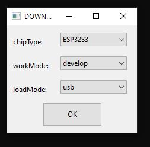
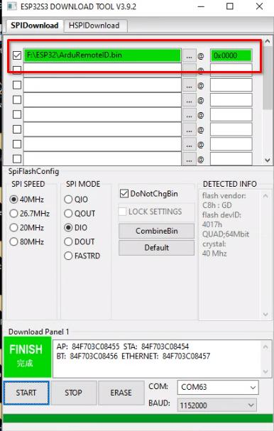

# ArduPilot RemoteID Transmitter

This is an implementation of a MAVLink and DroneCAN OpenDroneID
transmitter. It aims to provide a transmitter solution for the FAA
standard RemoteID requrement, meeting the transmitter component of the
ASTM F3586-22 Means of Compliance.

## Hardware Supported

The firmware currently supports the ESP32-S3 and ESP32-C3 chips. There
are 4 boards supported so far with more to come:

 - the ESP32-S3 dev board: https://au.mouser.com/ProductDetail/356-ESP32S3DEVKTM1N8
 - the ESP32-C3 dev board: https://au.mouser.com/ProductDetail/Espressif-Systems/ESP32-C3-DevKitM-1
 - a Bluemark DB110 (legacy) from https://bluemark.io/ ([product page](https://dronescout.co/dronebeacon-mavlink-remote-id-transponder/) | [buy](https://dronescout.co/product/dronebeacon-mavlink-pcb-only-transponder/))
 - a Bluemark DB200 from https://bluemark.io/ ([product page](https://dronescout.co/dronebeacon-mavlink-remote-id-transponder/) | [buy](https://dronescout.co/product/dronebeacon-mavlink-db200-transponder/))

Hardware from https://wurzbachelectronics.com/ is expected to be added soon.

For the ESP32-S3 dev board the pins assumed in this firmware are:

 - UART TX on pin 18
 - UART RX on pin 17
 - CAN TX on pin 47
 - CAN RX on pin 38

For the ESP32-C3 dev board the pins assumed in this firmware are:

 - UART TX on pin 3
 - UART RX on pin 2
 - CAN TX on pin 5
 - CAN RX on pin 4

For CAN a suitable 1MBit bxCAN transceiver needs to be connected to
the CAN TX/RX pins.

You can also do MAVLink on the USB UART port (the one marked "UART" on
the silkscreen). That allows for easy simulation testing by plugging
in a micro USB cable.

See board_config.h and Makefile for information on porting to new boards.

## Transmission Modes

This firmware supports the following transmission modes:

 - WiFi NAN (Neighbour Awareness Networking)
 - Bluetooth 4 Legacy Advertising
 - Bluetooth 5 Long Range + Extended Advertising

## Protocols

This firmware supports communication with an ArduPilot flight
controller either using MAVLink or DroneCAN.

For MAVLink the following service is used:
https://mavlink.io/en/services/opendroneid.html

For DroneCAN the following messages are used:
https://github.com/dronecan/DSDL/tree/master/dronecan/remoteid

The DroneCAN messages are an exact mirror of the MAVLink messages to
make a dual-transport implementation easy.

## Releases

Pre-built releases are in the releases folder on github.

## Flashing

To flash to an ESP32-S3 board use the espressif FlashTool from
https://www.espressif.com/en/support/download/other-tools

If this is the first time flashing the board, you may need to hold the "boot" button down while attaching the USB cable to the USB connector marked "USB"

and then use the pre-built binary in the releases folder to flash using
the following options, after selecting the COMM port that the board is attached:

subsequent re-flashing of newer releases should not require holding the "boot" button during power-up of the board as the USB cable is attached.

## ArduPilot Support

Support for OpenDroneID is in ArduPilot master and is pending for
addition to the 4.2.x stable releases. You need to enable it on a
board by setting "define AP_OPENDRONEID_ENABLED 1" in the hwdef.dat
for your board.

## Credit

Many thanks to the great work by:

 - OpenDroneID: https://github.com/opendroneid/
 - Steve Jack: https://github.com/sxjack/uav_electronic_ids
 - Roel Schiphorst: https://bluemark.io/
 - David Buzz: ESP32 CAN and bluetooth drivers

This firmware builds on their work.

## License

This firmware is licensed under the GNU GPLv3 or later
