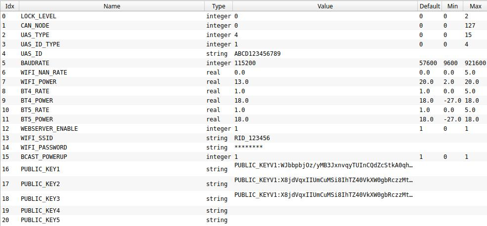

# ArduPilot RemoteID Transmitter

This is an implementation of a MAVLink and DroneCAN OpenDroneID
transmitter. It aims to provide a transmitter solution for the FAA
standard RemoteID requrement, meeting the transmitter component of the
ASTM F3586-22 Means of Compliance. It also aims to be compliant with the 
RemoteID regulation in the EU. 

It is the responsibility of the user to configure the ArduRemoteID firmware
in a way that it is compliant with the local RemoteID regulation. And example 
is to configure an allowed transmission protocol like dual Bluetooth transmission
(Bluetooth 4 + Bluetooth 5 Long Range) in the USA.

## Hardware Supported

The firmware currently supports the ESP32-S3 and ESP32-C3 chips. There
are 4 boards supported so far with more to come:

 - the ESP32-S3 dev board: https://au.mouser.com/ProductDetail/356-ESP32S3DEVKTM1N8
 - the ESP32-C3 dev board: https://au.mouser.com/ProductDetail/Espressif-Systems/ESP32-C3-DevKitM-1
 - a Bluemark DB110 (legacy) from https://bluemark.io/ ([product page](https://dronescout.co/dronebeacon-mavlink-remote-id-transponder/))
 - a Bluemark DB200 from https://bluemark.io/ ([product page](https://dronescout.co/dronebeacon-mavlink-remote-id-transponder/) | [buy](https://dronescout.co/product/dronebeacon-mavlink-db200-transponder/))
 - a Bluemark DB201 from https://bluemark.io/ ([product page](https://dronescout.co/dronebeacon-mavlink-remote-id-transponder/) | [buy](https://dronescout.co/product/dronebeacon-mavlink-db201-transponder/))

Hardware from https://wurzbachelectronics.com/ is expected to be added soon.

For the ESP32-S3 dev board the pins assumed in this firmware are:

 - UART TX on pin 18
 - UART RX on pin 17
 - CAN TX on pin 47
 - CAN RX on pin 38

For the ESP32-C3 dev board the pins assumed in this firmware are:

 - UART TX on pin 3
 - UART RX on pin 2
 - CAN TX on pin 5
 - CAN RX on pin 4

For CAN a suitable 1MBit bxCAN transceiver needs to be connected to
the CAN TX/RX pins.

You can also do MAVLink on the USB UART port (the one marked "UART" on
the silkscreen). That allows for easy simulation testing by plugging
in a micro USB cable.

See board_config.h and Makefile for information on porting to new boards.

## Transmission Modes

This firmware supports the following transmission modes:

 - WiFi Broadcast
 - WiFi NAN (Neighbour Awareness Networking)
 - Bluetooth 4 Legacy Advertising
 - Bluetooth 5 Long Range + Extended Advertising

## Protocols

This firmware supports communication with an ArduPilot flight
controller either using MAVLink or DroneCAN.

For MAVLink the following service is used:
https://mavlink.io/en/services/opendroneid.html

For DroneCAN the following messages are used:
https://github.com/dronecan/DSDL/tree/master/dronecan/remoteid

The DroneCAN messages are an exact mirror of the MAVLink messages to
make a dual-transport implementation easy.

## Releases

Pre-built releases are in the releases list folder on github.

https://github.com/ArduPilot/ArduRemoteID/releases

## Flashing

For initial firmload load, to flash to an ESP32-S3 board use the espressif FlashTool from

https://www.espressif.com/en/support/download/other-tools

If this is the first time flashing the board, you may need to hold the "boot" button down while attaching the USB cable to the USB connector marked "USB"

and then use the pre-built binary in the releases folder to flash using
the following options, after selecting the COMM port that the board is attached:


subsequent re-flashing of newer releases should not require holding the "boot" button during power-up of the board as the USB cable is attached.

If the board already runs ArduRemoteID, the preferred firmware upgrade method is to upload a new firmware file via the webinterface.

## Parameters

The firmware comes with a set of parameters which are accessible from
DroneCAN or MAVLink. The parameters allow for a lot of flexibility in
controlling the behaviour of the board.

DroneCAN allows control of any parameter. Using MAVLink only
non-string parameters are accessible.



Key parameters are:

 - LOCK_LEVEL: this controls the lockdown of the board. If this is set
   to a non-zero value then all parameters updates via DroneCAN will
   be prevented. To change parameters (including the LOCK_LEVEL) once
   this is set you need to use a DroneCAN SecureCommand. There is an
   example script in scripts/secure_command.py which can change any
   parameter if you know a private key corresponding to one of the
   public keys. 

 - UAS_TYPE, UAS_ID_TYPE and UAS_ID: these override the IDs in the
   RemoteID BasicID packet when they have all been set. These should
   be set by the vendor before shipping the vehicle.

 - WEBSERVER_ENABLE: this enables the building WiFi access point and
   webserver for status monitoring and secure firmware update.

 - PUBLIC_KEY1 to PUBLIC_KEY5: these are the public keys that will be
   used to verify firmware updates and secure update of parameters

## Web Server

The firmware comes with a builtin web server if the parameters
WEBSERVER_ENABLE is set. The WiFi access point will use a SSID from
WIFI_SSID and password from WIFI_PASSWORD which you can set with
DroneCAN parameter tools such as the DroneCAN GUI tool or
MissionPlanner CAN tool.

The default SSID is RID_xxxxxxxx where xxxxxxxx is the factory WiFi
MAC address of the board. The default password is ArduRemoteID.

The web server has a secure firmware update mechanism which will only
allow a properly signed firmware with a signature corresponding to one
of the 5 public keys in the parameters. If no public keys are set then
any firmware can be loaded.

The web server defaults to URL http://192.168.4.1 once you connect to
the WiFi access point.

## Firmware Signing

To generate public/private key pairs please use:

```
  scripts/generate_keys.py
```

the keys are compatible with the ArduPilot secure boot system. By
default the 3 ArduPilot release public keys are included.

Once you have generated a public key you can add it to the RemoteID
node using a DroneCAN parameter editor. Make sure you keep the private
key in a secure location.

To upload a firmware via the web server you need to use an "OTA" (Over
The Air) firmware, which is generated as OTA files in the build. You
then need to sign it with a private key corresponding to one of the
public keys on the RemoteID node.

To sign an OTA firmware you should use a command such as this one:

```
 scripts/sign_fw.py ArduRemoteID_ESP32S3_DEV_OTA.bin MyName_private_key.dat 1
```

The '1' on the end is the BOARD_ID. See board_config.h for the board
IDs for your board.

Once signed you can upload the firmware via the web server.

Set LOCK_LEVEL to -1 to skip any checks for the OTA upgrade like board ID 
check, signed firmware with a valid key. For LOCK_LEVEL 0 or higher, only
firmware files are accepted that match the board ID and are signed with a 
valid key. (OTA firmware files in the ArduRemoteID github page are always
signed with a valid key.)

## LOCK_LEVEL Parameter

The LOCK_LEVEL parameter is the way a vendor can lock down the
RemoteID board so that it is tamper resistant. if any valid public
keys have been set then setting LOCK_LEVEL=1 will prevent any
parameter changes using the DroneCAN or MAVLink interfaces. All
parameter changes will need to be made via the SecureCommand
signed interface.

Setting LOCK_LEVEL=2 will also cause the ESP32 eFuses to be set to
prevent firmware updates except via the signed web interface. This is
a permanent change and cannot be undone even if the LOCK_LEVEL is
changed back to 0 or 1 via SecureCommand.

Setting LOCK_LEVEL=-1 will skip any checks for upgrading the firmware 
via the web server like board ID check, signed firmware with a valid key.

The default LOCK_LEVEL=0 allows to change parameters and only allows 
firmware upgrades via the web server that have been signed with a valid key.
Also the board ID of the firmware file needs to match the board ID of the 
device.

## Secure Parameter Update

Once LOCK_LEVEL is 1 or 2 you cannot use normal parameter commands to
set parameters. Instead you need to use the DroneCAN SecureCommand
interface or the MAVLink SECURE_COMMAND interface.

For DroneCAN see the script in scripts/secure_command.py, for example
this command would change the UAS_TYPE to 3:

```
scripts/secure_command.py mavcan::14550 --private-key my_private_key.dat --target-node=125 UAS_TYPE=3
```

For MAVLink you can use the SecureCommand module in MAVProxy. For
example:

```
module load SecureCommand
securecommand set private_keyfile my_private_key.dat
securecommand getsessionkey
securecommand setconfig UAS_TYPE=3
```

You can also use secure commands to set LOCK_LEVEL back to zero, but
note that if you have set LOCK_LEVEL=2 then the setting of the eFuse
bits is not undone. You will be able to change parameters but you will
not be able to flash firmware via the USB port. You can still flash a
signed firmware using the web interface.

## ArduPilot Support

Support for OpenDroneID is in ArduPilot master and is also in the
4.2.3 stable releases and 4.3.x releases. You need to enable it on a
board by setting "define AP_OPENDRONEID_ENABLED 1" in the hwdef.dat
for your board or by using --enable-opendroneid when doing waf configure.

## Credit

Many thanks to the great work by:

 - OpenDroneID: https://github.com/opendroneid/
 - Steve Jack: https://github.com/sxjack/uav_electronic_ids
 - Roel Schiphorst: https://bluemark.io/
 - David Buzz: ESP32 CAN and bluetooth drivers

This firmware builds on their work.

## License

This firmware is licensed under the GNU GPLv2 or later
